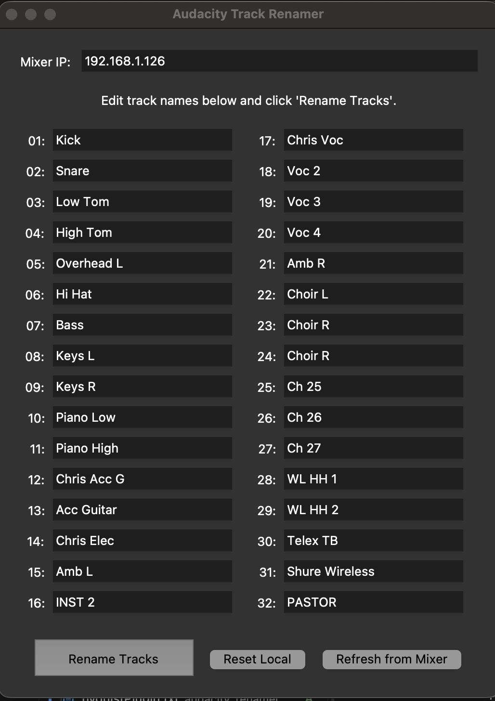

# KCBCSound Audio Tools

A collection of specialized Python utilities for audio engineering, broadcast automation, and mixer integration. This repository serves as a centralized hub for tools designed to streamline workflows between digital audio workstations (DAWs) and hardware mixing consoles.

## 🛠 Project Ecosystem

Currently, this repository hosts the following sub-projects:

### 1. Audacity Track Renamer & WING Sync
A GUI-based utility to bridge the gap between a **Behringer WING** console and **Audacity**. 
* **Location**: `/audacity_renamer`
* **Key Features**: Bi-directional name syncing via OSC, automated track labeling via `mod-script-pipe`, and cross-platform desktop bundling.
* **Status**: Stable / Production



## 🚀 Getting Started

This repository uses [uv](https://github.com/astral-sh/uv) for high-performance dependency management and project isolation.

### Prerequisites
* **Python 3.13+**
* **uv**: `pip install uv`
* **Tkinter**: (Linux users) `sudo dnf install python3-tkinter` (Fedora) or `sudo apt install python3-tk` (Ubuntu).

### Global Installation
Clone the repository and sync the workspace:
```bash
git clone [https://github.com/SEary342/KCBCSound.git](https://github.com/SEary342/KCBCSound.git)
cd KCBCSound
uv sync